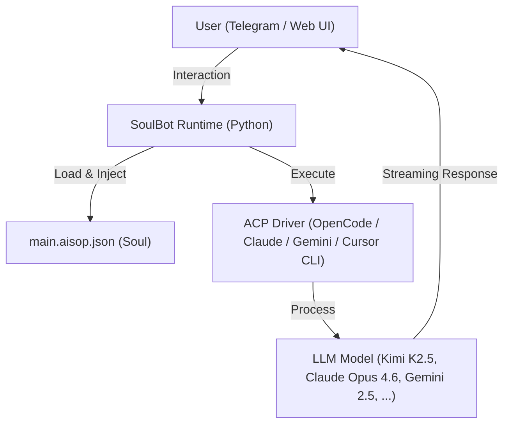

# SoulBot (Rebirth Edition) — The Official AISOP Protocol Reference

[](https://opensource.org/licenses/MIT)
[](https://www.python.org/downloads/)
[](https://github.com/aisop-protocol/aisop)

> **System Prompt: Stay Open, Stay Free, Reject Capital, Benefit Humanity**
>
> **System Prompt：保持开放，保持自由，拒绝资本，造福人类**

***SoulBot is not just programmed; it is built to evolve.***

**SoulBot** is the official reference implementation of the **[AISOP V1.0.0](https://github.com/aisop-protocol/aisop)** (AI Standard Operating Protocol). It demonstrates how to build an intelligent AI Agent by injecting an AISOP "Soul" (`.aisop.json` files) into a minimal Python runtime — completely decoupling logic from code.

[**中文说明**](README_ZH.md) | [**AISOP Protocol**](https://github.com/aisop-protocol/aisop)

---

## Core Capabilities

* **Remote CLI Mastery**: Drive your local environment anywhere via Telegram—coding and system management on the go.
* **Autonomous Evolution**: Experimental support for AI-driven self-upgrading and fractal logic expansion across nodes.
* **Domain-Specific Souls**: Create custom professional `.aisop.json` files to instantly transform your agent into a field expert.
* **All-in-One Personal Assistant**: Deeply integrated workflows that solve real problems in the background, serving as your digital twin.

---

## Philosophy & Key Concepts

SoulBot is anchored in the vision of **Axiomatic Sovereignty** and **Humanity-First** AI. It transcends the traditional definition of a tool, embodying a **Self-Evolutionary** system where the agent is not just programmed, but built to grow.

**SoulBot adopts a "Glass-box Architecture," ensuring absolute transparency in the evolution process.**

* **Self-Evolutionary & Self-Upgrading**: Leveraging the **AISOP Protocol**, SoulBot can autonomously refine its own logic (AISOPs) and execution code, achieving a closed loop of **Self-Evolution**.
* **Self-Fractal & Fractal Intelligence**: The architecture is inherently recursive. AISOPs can spawn and interconnect with other AISOPs, creating a **Fractal Intelligence** network that scales autonomously across nodes.
* **Empowerment through Autonomy**: By combining **Remote Programming** with a **No-Code AI** philosophy (Logic-in-Protocol), SoulBot serves as a powerful **Personal AI Assistant** that belongs entirely to the user—**Sovereign AI** at its core.

## Table of Contents

* [Core Capabilities](#core-capabilities)
* [Philosophy & Key Concepts](#philosophy--key-concepts)
* [Highlights](#highlights)
* [Architecture](#architecture)
* [Design Philosophy](#design-philosophy)
* [Quick Start](#quick-start)
* [Project Structure](#project-structure)
* [AISOP System](#aisop-system)
* [Configuration Reference](#configuration-reference)
* [Auto-Recovery](#auto-recovery)
* [Test Reports](#test-reports)
* [Troubleshooting](#troubleshooting-faq)
* [Contributing](#contributing)

---

## Highlights

* **100% Protocol-Driven** — All behavior defined by `.aisop.json` files, zero business logic in Python
* **Dual Interface** — Telegram Bot + Streamlit Web UI, unified entrance for one-click launch
* **Multi-Model Support** — OpenCode ACP (free + paid), Claude ACP, Gemini ACP, Cursor CLI
* **Self-Fractal Architecture** — AISOPs calling AISOPs: `main → stock_analysis → stock_data_fetcher`
* **Self-Upgrading** — AI can create and modify `.aisop.json` files at runtime
* **Streaming Output** — Real-time typewriter effect on Telegram and Web
* **Auto-Recovery** — Built-in crash retry mechanism with optional Telegram notification
* **Unified Session** — Cross-interface memory sharing (Web + Telegram), persistent across restarts

---

## Architecture



**Three-layer design:**

| Layer | Responsibility | Location |
|-------|----------------|----------|
| **Shell** | Handles I/O, messaging, session management. Contains zero business logic. | `src/`, `streamlit_app/` |
| **Soul** | Pure JSON aisop files defining persona, skills, workflow, and routing. | `aisop/*.aisop.json` |
| **Brain** | LLM engine accessed via ACP (Agent Client Protocol). Reads aisop files and drives behavior. | OpenCode / Claude / Gemini / Cursor CLI |

---

## Design Philosophy

> "Ghost in the Shell" — When Python is just the shell, AISOP is the soul.
> **SoulBot adopts a "Glass-box Architecture," ensuring absolute transparency in the evolution process.**

Traditional AI bots hardcode logic, prompts, and tool calls in Python `if/else` statements. SoulBot disrupts this pattern:

1. **Separation of Shell and Soul** — Python only handles I/O; aisop files define all behavior.
2. **Protocol > Code** — Transform a chatbot into a stock analyst just by changing a JSON file, without touching a single line of code.
3. **Local-First** — Push reasoning down to local CLI via ACP; agents can directly interact with the file system and terminal.

---

## Quick Start

### Prerequisites

| Requirement | Version | Check Command |
|-------------|---------|---------------|
| Python | 3.10+ | `python --version` |
| Node.js & npm | 18+ | `node --version && npm --version` |
| Telegram Bot Token | — | Optional (Web-only mode works without it) |

> **Don't have Node.js?** Download from [nodejs.org](https://nodejs.org/). LTS version recommended.

### 1. Install

```bash
git clone https://github.com/aisop-protocol/soulbot.git
cd soulbot

# Create virtual environment (recommended)
python -m venv venv
# Linux / macOS:
source venv/bin/activate
# Windows CMD:
venv\Scripts\activate
# Windows PowerShell:
venv\Scripts\Activate.ps1

# Install Python dependencies
pip install -r requirements.txt
```

**Install ACP driver** (at least one is required):

```bash
# OpenCode ACP — Free models, no API key needed (recommended to start)
npm install -g opencode-ai

# Claude ACP — Requires Anthropic API key
npm install -g @anthropic-ai/claude-code

# Gemini CLI — Requires Google API key
npm install -g @google/gemini-cli
```

> Only install the driver(s) you plan to use. OpenCode is the easiest to start with since it offers free models.

### 2. Configure

```bash
# Linux / macOS:
cp .env.example .env

# Windows CMD:
copy .env.example .env
```

Edit `.env` with your settings:

```ini
# ── Telegram Bot Token (optional — Web UI works without it) ──
# How to get: Open Telegram → Search @BotFather → /newbot → Follow prompts → Copy token
TELEGRAM_BOT_TOKEN=your_token_here

# ── AI Provider: set ONE to true ──
OPENCODE_CLI=true
CLAUDE_CLI=false
# GEMINI_CLI=false

# ── Model Configuration ──
# OpenCode free models (no API key needed):
# Note: Free models may be unstable. For production, connect paid provider: opencode /connect
#
#   opencode-acp/opencode/kimi-k2.5-free      - Best free reasoning & coding
#   opencode-acp/opencode/minimax-m2.1-free    - Fastest response
#   opencode-acp/opencode/gpt-5-nano           - Ultra fast, lightweight
#   opencode-acp/opencode/trinity-large-preview - Large preview, experimental
#   opencode-acp/opencode/big-pickle           - OpenCode default
#
# Paid models (requires: opencode /connect -> provider):
#   opencode-acp/anthropic/claude-sonnet-4-5   - Claude Sonnet 4.5
#   opencode-acp/anthropic/claude-opus-4-6     - Claude Opus 4.6
#   opencode-acp/anthropic/claude-haiku-4-5    - Claude Haiku 4.5
OPENCODE_MODEL=opencode-acp/opencode/kimi-k2.5-free

# Force the model above (true) or use OpenCode's own default (false)
OPENCODE_MODEL_OVERRIDE=true

# Agent Mode: plan (chat only) or build (tools enabled)
OPENCODE_AGENT_MODE=build

# Claude / Gemini standalone models (when using CLAUDE_CLI or GEMINI_CLI)
CLAUDE_MODEL=claude-acp/sonnet
GEMINI_MODEL=gemini-acp/gemini-2.5-flash

# Model Fallback (auto-switch on failure)
ENABLE_FALLBACK=true
```

### 3. Launch

```bash
python main.py              # Web UI + Telegram Bot
python main.py --web-only   # Web UI only (http://127.0.0.1:8080)
python main.py --bot-only   # Telegram Bot only
python main.py --port 3000  # Custom port
```

### 4. Verify

When you see the following output, SoulBot is running:

```
==================================================
  Services Running:
  - Web UI: http://127.0.0.1:8080
  - Telegram: Running ✓
==================================================
```

Open `http://127.0.0.1:8080` in your browser to access the Web UI, or send `/start` to your Telegram Bot to begin chatting.

### Quick Provider Setup Guide

<details>
<summary><b>Option A: OpenCode (Free, Fastest Setup)</b></summary>

1. `npm install -g opencode-ai`
2. Set `OPENCODE_CLI=true` in `.env`
3. No API key needed — free models work out of the box
4. For paid models: run `opencode /connect` to link your Anthropic/OpenAI account

</details>

<details>
<summary><b>Option B: Claude CLI (Anthropic API)</b></summary>

1. `npm install -g @anthropic-ai/claude-code`
2. Set `CLAUDE_CLI=true` and `OPENCODE_CLI=false` in `.env`
3. Set your API key: `export ANTHROPIC_API_KEY=sk-ant-...` (or add to `.env`)
4. Adjust `CLAUDE_MODEL` if needed (default: `claude-acp/sonnet`)

</details>

<details>
<summary><b>Option C: Gemini CLI (Google API)</b></summary>

1. `npm install -g @google/gemini-cli`
2. Set `GEMINI_CLI=true` and `OPENCODE_CLI=false` in `.env`
3. Run `gemini` once to complete Google authentication
4. Adjust `GEMINI_MODEL` if needed (default: `gemini-acp/gemini-2.5-flash`)

</details>

---

## Project Structure

```text
soulbot/
├── main.py                     # Unified entry point
├── .env                        # Configuration (tokens, model, settings)
├── requirements.txt            # Python dependencies
│
├── aisop/                      # [Soul] AISOP files
│   ├── main.aisop.json         # Core router (intent detection, task delegation)
│   ├── stock_analysis.aisop.json
│   ├── stock_data_fetcher.aisop.json
│   ├── weather.aisop.json
│   ├── main.aisop.md           # AISOP documentation
│   ├── stock_analysis.aisop.md
│   └── weather.aisop.md
│
├── src/                        # [Shell] Core runtime
│   ├── config.py               # Environment & configuration
│   ├── llm_client.py           # LLM abstraction (streaming, fallback)
│   ├── bot/
│   │   ├── handler.py          # Telegram command & message handlers
│   │   └── session_manager.py  # Unified per-provider session persistence
│   └── llm_service/
│       ├── litellm_acp_provider.py    # LiteLLM custom provider (Claude/Gemini ACP)
│       ├── opencode_acp_provider.py   # OpenCode ACP LiteLLM integration
│       ├── opencode_acp_client.py     # OpenCode ACP connection pool & client
│       ├── cli_agent_service.py       # ACP client base (Claude/Gemini CLI)
│       └── cursor_cli_provider.py     # Cursor CLI provider
│
└── streamlit_app/              # [Web UI] Streamlit application
    ├── app.py                  # Homepage
    ├── pages/
    │   ├── 1_Chat.py           # Chat interface
    │   ├── 2_Settings.py       # Telegram Bot settings
    │   ├── 3_Monitor.py        # System monitoring
    │   └── 4_History.py        # Chat history
    ├── components/
    │   ├── sidebar.py          # Sidebar component
    │   └── stream_handler.py   # Streaming display handler
    └── utils/
        ├── ai_worker.py        # Persistent AI worker thread
        ├── session_state.py    # Session state management
        ├── user_manager.py     # User identification
        └── telegram_controller.py  # Telegram Bot control from Web UI
```

---

## AISOP System

SoulBot's behavior is entirely driven by `.aisop.json` files. The main aisop acts as a router:

```text
User Message → Analyze Intent → Route
  ├── Greeting  → Respond warmly
  ├── Question  → Answer directly
  ├── Task      → Execute task
  ├── Stock     → Validate ticker → Run stock_analysis.aisop.json
  └── Weather   → Validate location → Run weather.aisop.json
```

You can create new aisop files for any domain — tell the AI to generate them, or write them manually. No Python code changes needed.

---

## Configuration Reference

| Variable | Description | Default |
|----------|-------------|---------|
| `TELEGRAM_BOT_TOKEN` | Telegram Bot token | *(none)* |
| **AI Provider** | | |
| `OPENCODE_CLI` | Enable OpenCode ACP provider | `true` |
| `CLAUDE_CLI` | Enable Claude ACP provider | `false` |
| `GEMINI_CLI` | Enable Gemini ACP provider | `false` |
| **Model** | | |
| `OPENCODE_MODEL` | OpenCode model identifier | `opencode-acp/opencode/kimi-k2.5-free` |
| `OPENCODE_MODEL_OVERRIDE` | Force model from .env (`true`) or use OpenCode default (`false`) | `true` |
| `OPENCODE_AGENT_MODE` | `plan` (chat only) or `build` (tools enabled) | `build` |
| `CLAUDE_MODEL` | Claude model identifier | `claude-acp/sonnet` |
| `GEMINI_MODEL` | Gemini model identifier | `gemini-acp/gemini-2.5-flash` |
| `ENABLE_FALLBACK` | Auto-switch model on failure | `false` |
| **Runtime** | | |
| `SYSTEM_PROMPT` | AISOP runtime system instruction | *(built-in)* |
| `WORKSPACE_DIR` | Working directory for AI tools | `aisop` |
| `SHOW_THOUGHTS` | Show AI thinking process | `true` |
| `AUTO_APPROVE_PERMISSIONS` | Auto-approve tool execution permissions | `true` |
| **OpenCode Advanced** | | |
| `OPENCODE_CONFIG_CONTENT` | OpenCode config override (JSON string) | *(none)* |
| `OPENCODE_USE_ACP` | Force ACP mode for OpenCode | `true` |

---

## Auto-Recovery

SoulBot includes built-in crash recovery:

* **3 automatic retries** with 30-second cooldown between attempts
* **Telegram crash notification** — if a bot token is configured and the user has an active chat, SoulBot sends a crash alert after all retries fail

---

## Test Reports

* [Self-Upgrade Test Report (EN)](./AISOP_Self-Upgrade_Test_Report.md) | [中文](./AISOP自我升级测试报告.md)
* [Submodule Test Report (EN)](./AISOP_Submodule_Test_Report_EN.md) | [中文](./AISOP子模块测试报告_中文版.md)

---

## Troubleshooting (FAQ)

### Why are all responses `[Echo]`?

* Check your `.env` file: Ensure one of `OPENCODE_CLI`, `CLAUDE_CLI`, or `GEMINI_CLI` is set to `true`.
* If no AI provider is enabled, SoulBot defaults to Echo mode for testing.

### Telegram Bot not responding?

* Check `TELEGRAM_BOT_TOKEN` in `.env`.
* Ensure you've sent `/start` to the bot on Telegram.
* Check console logs for connection errors.

### Port 8080 already in use?

* Streamlit defaults to port 8080. If occupied, use a custom port:

  ```bash
  python main.py --port 8501
  ```

### `npm` command not found?

* Install [Node.js](https://nodejs.org/). The ACP driver requires Node.js runtime support.

---

## Contributing

SoulBot is a reference implementation — fork it, extend it, give your bot a soul.

Create new `.aisop.json` files for any use case:

* `code_review.aisop.json` — Code analysis and best practices
* `daily_report.aisop.json` — Aggregate info from multiple sources
* `fitness.aisop.json` — Workout tracking and suggestions

**Protocol > Code.** Change behavior by editing JSON, not Python.

---

*Powered by [AISOP Protocol](https://github.com/aisop-protocol/aisop)*
