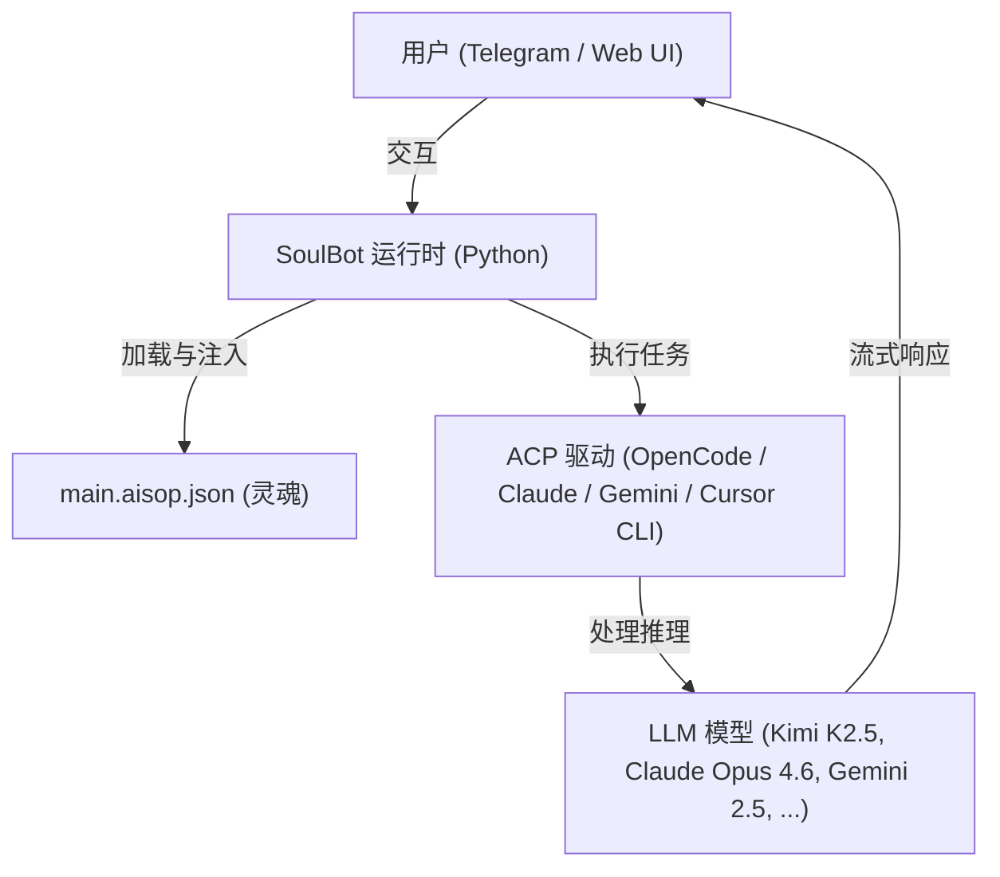

# SoulBot (Rebirth Edition): 基于 AISOP 协议的自主 AI 重生版

[](https://opensource.org/licenses/MIT)
[](https://www.python.org/downloads/)
[](https://github.com/aisop-protocol/aisop)

> **System Prompt: Stay Open, Stay Free, Reject Capital, Benefit Humanity**
>
> **System Prompt：保持开放，保持自由，拒绝资本，造福人类**

***SoulBot 不仅仅是被编程出来的，它是为了进化而生的。***

**SoulBot** 是 **[AISOP V1.0.0](https://github.com/aisop-protocol/aisop)**（AI 标准执行协议）的官方参考实现。它展示了如何向极简的 Python 运行时注入 AISOP「灵魂」（`.aisop.json` 文件），将业务逻辑与代码完全解耦，构建出真正智能的 AI Agent。

[**English**](README.md) | [**AISOP Protocol**](https://github.com/aisop-protocol/aisop)

---

## 核心能力

* **Telegram 远程编程**：通过 Telegram 界面直接驱动本地 CLI，实现随时随地的远程开发与系统管理。
* **自我进化与分形扩展**：实验性支持 AI 自动代码升级 与 逻辑分形扩展，赋予智能体跨节点自我增殖与进化的能力。
* **专业级 AISOP 定制**：允许用户自定义专业领域的 `.aisop.json` 文件，瞬间将智能体转化为特定行业的顶级专家。
* **全能个人助理**：深度集成工作流，不仅是对话机器人，更是真正在后台帮你解决问题的数字孪生助手。

---

## 哲学与核心理念

SoulBot 植根于 **公理主权 (Axiomatic Sovereignty)** 与 **造福人类 (Humanity-First)** 的愿景。它超越了传统工具的范畴，是一个真正的 **自演化 (Self-Evolutionary)** 系统。在这里，智能体不仅是被执行的代码，更是为了进化而生的生命体。

**SoulBot 采用"玻璃盒架构 (Glass-box Architecture)"，确保自演化过程绝对透明。**

* **自演化与自我升级 (Self-Evolutionary & Self-Upgrading)**：依托 **AISOP 协议**，SoulBot 能够自主修改自身的逻辑（AISOP）与执行代码，实现 **自我进化 (Self-Evolution)** 的闭环。
* **自我分形与分形智能 (Self-Fractal & Fractal Intelligence)**：SoulBot 的架构本质上是递归的。AISOP 可以派生并链接其他 AISOP，构建出一个跨节点、跨领域的 **分形智能** 网络，实现自主扩展。
* **通过自治赋能 (Empowerment through Autonomy)**：通过将 **Telegram 远程编程** 与 **无代码 AI (No-Code AI)** 理念（逻辑封装于协议）相结合，SoulBot 成为了真正属于用户的 **公理主权 AI** —— 一个不知疲倦的 **全能个人助理**。

## 目录

* [核心能力](#核心能力)
* [哲学与核心理念](#哲学与核心理念)
* [特性亮点](#特性亮点)
* [架构](#架构)
* [设计理念](#设计理念)
* [快速开始](#快速开始)
* [目录结构](#目录结构)
* [AISOP 系统](#aisop-系统)
* [配置参考](#配置参考)
* [自动恢复](#自动恢复)
* [测试报告](#测试报告)
* [常见问题 (FAQ)](#常见问题-faq)
* [贡献](#贡献)

---

## 特性亮点

* **100% 协议驱动** — 所有行为由 `.aisop.json` 文件定义，Python 中零业务逻辑
* **双界面** — Telegram Bot + Streamlit Web UI，统一入口一键启动
* **多模型支持** — OpenCode ACP（免费模型 + 付费模型）、Claude ACP、Gemini ACP、Cursor CLI
* **自分形架构** — AISOP 调用 AISOP：`main → stock_analysis → stock_data_fetcher`
* **自我升级** — AI 可在运行时创建和修改 `.aisop.json` 文件
* **流式输出** — Telegram 和 Web 上实时打字机效果
* **自动恢复** — 内建崩溃重试机制，可选 Telegram 通知
* **统一会话** — Web 与 Telegram 跨接口记忆共享，重启后持久保持

---

## 架构



**三层设计：**

| 层次 | 职责 | 位置 |
|------|------|------|
| **躯壳 (Shell)** | 处理 I/O、消息收发、会话管理。不包含任何业务逻辑。 | `src/`、`streamlit_app/` |
| **灵魂 (Soul)** | 纯 JSON AISOP 文件，定义人设、技能、工作流和路由。 | `aisop/*.aisop.json` |
| **大脑 (Brain)** | 通过 ACP（Agent Client Protocol）访问的 LLM 引擎，读取 AISOP 文件并驱动行为。 | OpenCode / Claude / Gemini / Cursor CLI |

---

## 设计理念

> "Ghost in the Shell" — 当 Python 只是躯壳，AISOP 才是灵魂。
> **SoulBot 采用"玻璃盒架构 (Glass-box Architecture)"，确保自演化过程绝对透明。**

传统 AI Bot 把逻辑、Prompt 和工具调用硬编码在 Python `if/else` 里。SoulBot 颠覆了这一模式：

1. **躯壳与灵魂分离** — Python 只负责 I/O，AISOP 文件定义一切行为
2. **协议优于代码** — 改 JSON 文件就能把聊天机器人变成股票分析师，不动一行代码
3. **本地优先** — 通过 ACP 将推理下沉到本地 CLI，Agent 可直接操作文件系统和终端

---

## 快速开始

### 前置要求

| 依赖项 | 版本要求 | 检查命令 |
|--------|---------|---------|
| Python | 3.10+ | `python --version` |
| Node.js & npm | 18+ | `node --version && npm --version` |
| Telegram Bot Token | — | 可选（仅 Web 模式不需要） |

> **没有安装 Node.js？** 前往 [nodejs.org](https://nodejs.org/) 下载，推荐 LTS 版本。

### 1. 安装

```bash
git clone https://github.com/aisop-protocol/soulbot.git
cd soulbot

# 创建虚拟环境（推荐）
python -m venv venv
# Linux / macOS:
source venv/bin/activate
# Windows CMD:
venv\Scripts\activate
# Windows PowerShell:
venv\Scripts\Activate.ps1

# 安装 Python 依赖
pip install -r requirements.txt
```

**安装 ACP 驱动**（至少安装一个）：

```bash
# OpenCode ACP — 免费模型，无需 API Key（推荐新手入门）
npm install -g opencode-ai

# Claude ACP — 需要 Anthropic API Key
npm install -g @anthropic-ai/claude-code

# Gemini CLI — 需要 Google API Key
npm install -g @google/gemini-cli
```

> 只需安装你计划使用的驱动。OpenCode 是最简单的入门选择，因为它提供免费模型。

### 2. 配置

```bash
# Linux / macOS:
cp .env.example .env

# Windows CMD:
copy .env.example .env
```

编辑 `.env`：

```ini
# ── Telegram Bot Token（可选 — 仅 Web 模式不需要）──
# 获取方式：打开 Telegram → 搜索 @BotFather → 发送 /newbot → 按提示操作 → 复制 Token
TELEGRAM_BOT_TOKEN=your_token_here

# ── AI 提供商：设置其中一个为 true ──
OPENCODE_CLI=true
CLAUDE_CLI=false
# GEMINI_CLI=false

# ── 模型配置 ──
# OpenCode 免费模型（无需 API Key）：
# 注意：免费模型可能不稳定，生产环境建议连接付费模型：opencode /connect
#
#   opencode-acp/opencode/kimi-k2.5-free      - 最佳免费推理和编程
#   opencode-acp/opencode/minimax-m2.1-free    - 最快响应速度
#   opencode-acp/opencode/gpt-5-nano           - 超快、轻量
#   opencode-acp/opencode/trinity-large-preview - 大模型预览，实验性
#   opencode-acp/opencode/big-pickle           - OpenCode 默认
#
# 付费模型（需先执行 opencode /connect 连接供应商）：
#   opencode-acp/anthropic/claude-sonnet-4-5   - Claude Sonnet 4.5
#   opencode-acp/anthropic/claude-opus-4-6     - Claude Opus 4.6
#   opencode-acp/anthropic/claude-haiku-4-5    - Claude Haiku 4.5
OPENCODE_MODEL=opencode-acp/opencode/kimi-k2.5-free

# 模型覆盖开关
# true:  强制使用上方指定的模型（默认）
# false: 使用 OpenCode 自身的默认模型
OPENCODE_MODEL_OVERRIDE=true

# Agent 模式：plan（纯对话）或 build（启用工具）
OPENCODE_AGENT_MODE=build

# Claude / Gemini 独立模型（当使用 CLAUDE_CLI 或 GEMINI_CLI 时）
CLAUDE_MODEL=claude-acp/sonnet
GEMINI_MODEL=gemini-acp/gemini-2.5-flash

# 模型降级（失败时自动切换）
ENABLE_FALLBACK=true
```

### 3. 启动

```bash
python main.py              # Web UI + Telegram Bot
python main.py --web-only   # 仅 Web 界面 (http://127.0.0.1:8080)
python main.py --bot-only   # 仅 Telegram Bot
python main.py --port 3000  # 自定义端口
```

### 4. 验证

看到如下输出即表示启动成功：

```
==================================================
  Services Running:
  - Web UI: http://127.0.0.1:8080
  - Telegram: Running ✓
==================================================
```

浏览器打开 `http://127.0.0.1:8080` 即可访问 Web 界面，或在 Telegram 中给 Bot 发送 `/start` 开始聊天。

### 快速提供商配置指南

<details>
<summary><b>方案 A：OpenCode（免费，最快上手）</b></summary>

1. `npm install -g opencode-ai`
2. 在 `.env` 中设置 `OPENCODE_CLI=true`
3. 无需 API Key — 免费模型开箱即用
4. 如需使用付费模型：执行 `opencode /connect` 连接你的 Anthropic/OpenAI 账户

</details>

<details>
<summary><b>方案 B：Claude CLI（Anthropic API）</b></summary>

1. `npm install -g @anthropic-ai/claude-code`
2. 在 `.env` 中设置 `CLAUDE_CLI=true`，`OPENCODE_CLI=false`
3. 设置 API Key：`export ANTHROPIC_API_KEY=sk-ant-...`（或添加到 `.env`）
4. 按需调整 `CLAUDE_MODEL`（默认：`claude-acp/sonnet`）

</details>

<details>
<summary><b>方案 C：Gemini CLI（Google API）</b></summary>

1. `npm install -g @google/gemini-cli`
2. 在 `.env` 中设置 `GEMINI_CLI=true`，`OPENCODE_CLI=false`
3. 首次运行 `gemini` 命令完成 Google 账户认证
4. 按需调整 `GEMINI_MODEL`（默认：`gemini-acp/gemini-2.5-flash`）

</details>

---

## 目录结构

```text
soulbot/
├── main.py                     # 统一启动入口
├── .env                        # 配置文件（Token、模型、设置）
├── requirements.txt            # Python 依赖
│
├── aisop/                      # [灵魂] AISOP 文件
│   ├── main.aisop.json         # 核心路由器（意图识别、任务分发）
│   ├── stock_analysis.aisop.json
│   ├── stock_data_fetcher.aisop.json
│   ├── weather.aisop.json
│   ├── main.aisop.md           # AISOP 说明文档
│   ├── stock_analysis.aisop.md
│   └── weather.aisop.md
│
├── src/                        # [躯壳] 核心运行时
│   ├── config.py               # 环境变量与配置管理
│   ├── llm_client.py           # LLM 抽象层（流式、降级）
│   ├── bot/
│   │   ├── handler.py          # Telegram 命令与消息处理
│   │   └── session_manager.py  # 统一 per-provider 会话持久化
│   └── llm_service/
│       ├── litellm_acp_provider.py    # LiteLLM 自定义 Provider（Claude/Gemini ACP）
│       ├── opencode_acp_provider.py   # OpenCode ACP LiteLLM 集成
│       ├── opencode_acp_client.py     # OpenCode ACP 连接池与客户端
│       ├── cli_agent_service.py       # ACP 客户端基类（Claude/Gemini CLI）
│       └── cursor_cli_provider.py     # Cursor CLI Provider
│
└── streamlit_app/              # [Web UI] Streamlit 应用
    ├── app.py                  # 首页
    ├── pages/
    │   ├── 1_Chat.py           # 聊天界面
    │   ├── 2_Settings.py       # Telegram Bot 设置
    │   ├── 3_Monitor.py        # 系统监控
    │   └── 4_History.py        # 聊天历史
    ├── components/
    │   ├── sidebar.py          # 侧边栏组件
    │   └── stream_handler.py   # 流式显示处理器
    └── utils/
        ├── ai_worker.py        # 持久化 AI 工作线程
        ├── session_state.py    # 会话状态管理
        ├── user_manager.py     # 用户标识管理
        └── telegram_controller.py  # Web 端 Telegram Bot 控制器
```

---

## AISOP 系统

SoulBot 的行为完全由 `.aisop.json` 文件驱动。主 AISOP 充当路由器：

```text
用户消息 → 分析意图 → 路由
  ├── 问候    → 友好回复
  ├── 提问    → 直接回答
  ├── 任务    → 执行任务
  ├── 股票    → 验证代码 → 运行 stock_analysis.aisop.json
  └── 天气    → 验证地点 → 运行 weather.aisop.json
```

你可以为任何领域创建新的 AISOP 文件 — 让 AI 生成，或手动编写。无需修改任何 Python 代码。

---

## 配置参考

| 变量 | 说明 | 默认值 |
|------|------|--------|
| `TELEGRAM_BOT_TOKEN` | Telegram Bot 令牌 | *(无)* |
| **AI 提供商** | | |
| `OPENCODE_CLI` | 启用 OpenCode ACP | `true` |
| `CLAUDE_CLI` | 启用 Claude ACP | `false` |
| `GEMINI_CLI` | 启用 Gemini ACP | `false` |
| **模型配置** | | |
| `OPENCODE_MODEL` | OpenCode 模型标识 | `opencode-acp/opencode/kimi-k2.5-free` |
| `OPENCODE_MODEL_OVERRIDE` | 强制使用 .env 中的模型 (`true`) 或使用 OpenCode 默认 (`false`) | `true` |
| `OPENCODE_AGENT_MODE` | `plan`（纯对话）或 `build`（启用工具） | `build` |
| `CLAUDE_MODEL` | Claude 模型标识 | `claude-acp/sonnet` |
| `GEMINI_MODEL` | Gemini 模型标识 | `gemini-acp/gemini-2.5-flash` |
| `ENABLE_FALLBACK` | 模型失败时自动切换 | `false` |
| **运行时** | | |
| `SYSTEM_PROMPT` | AISOP 运行时系统指令 | *(内置)* |
| `WORKSPACE_DIR` | AI 工具的工作目录 | `aisop` |
| `SHOW_THOUGHTS` | 显示 AI 思考过程 | `true` |
| `AUTO_APPROVE_PERMISSIONS` | 自动批准工具执行权限 | `true` |
| **OpenCode 高级** | | |
| `OPENCODE_CONFIG_CONTENT` | OpenCode 配置覆盖（JSON 字符串） | *(无)* |
| `OPENCODE_USE_ACP` | 强制 OpenCode 使用 ACP 模式 | `true` |

---

## 自动恢复

SoulBot 内建崩溃恢复机制：

* **3 次自动重试**，每次间隔 30 秒
* **Telegram 崩溃通知** — 如果配置了 Bot Token 且用户有活跃的对话，重试全部失败后会发送崩溃告警

---

## 测试报告

* [自我升级测试报告](./AISOP自我升级测试报告.md) | [English](./AISOP_Self-Upgrade_Test_Report.md)
* [子模块测试报告](./AISOP子模块测试报告_中文版.md) | [English](./AISOP_Submodule_Test_Report_EN.md)

---

## 常见问题 (FAQ)

### 为什么回复全是 `[Echo]`？

* 检查 `.env` 文件：确保 `OPENCODE_CLI`、`CLAUDE_CLI` 或 `GEMINI_CLI` 其中一个被设置为 `true`。
* 如果没有启用任何 AI 提供商，SoulBot 会默认进入回声模式用于测试。

### Telegram Bot 没反应？

* 检查 `.env` 中的 `TELEGRAM_BOT_TOKEN` 是否正确。
* 确保你已经在 Telegram 中向 Bot 发送了 `/start` 开始对话。
* 查看控制台日志是否有连接错误。

### 端口 8080 被占用？

* Streamlit 默认使用 8080 端口。如果被占用，可以使用自定义端口启动：

  ```bash
  python main.py --port 8501
  ```

### 找不到 `npm` 命令？

* 请安装 [Node.js](https://nodejs.org/)。ACP 驱动需要 Node.js 运行时支持。

---

## 贡献

SoulBot 是参考实现 — Fork 它，扩展它，赋予你的 Bot 灵魂。

为任何场景创建 `.aisop.json` 文件：

* `code_review.aisop.json` — 代码审查和最佳实践
* `daily_report.aisop.json` — 多源信息聚合日报
* `fitness.aisop.json` — 健身追踪和建议

**协议优于代码。** 修改 JSON，而非 Python。

---

*Powered by [AISOP Protocol](https://github.com/aisop-protocol/aisop)*
