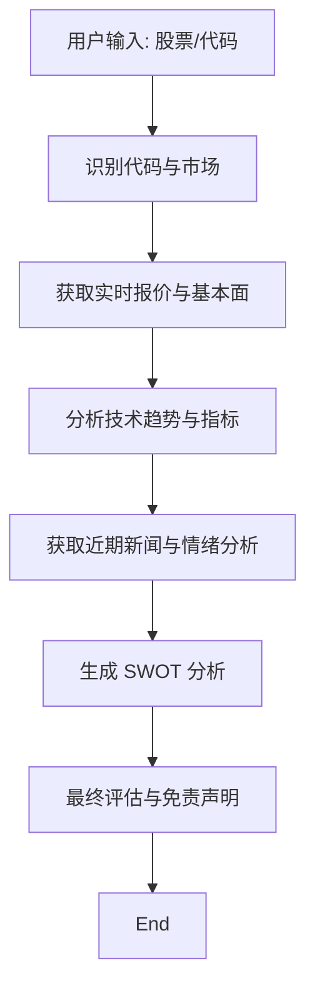

# AISOP：股票分析引擎

此 AISOP 定义了一个用于多维度股票分析的专业级执行流程。

> **协议版本**: AISOP 3.1
> **ID**: `soulbot.stock_analysis`

## 1. 视觉逻辑 (Mermaid)



## 2. 实现 (JSON)

```json
[
  {
    "role": "system",
    "content": {
        "protocol": "AISOP V1.0.0",
        "id": "soulbot.stock_analysis",
        "verified_on": ["Cursor", "Gemini CLI"],
        "tools": ["google_search", "terminal", "file_system", "web_browser"]
    }
  },
  {
    "role": "user",
    "content": {
        "instruction": "Execute aisop.stock_analysis",
        "aisop": {
            "main": "graph TD\n    Start[User Input: Stock/Ticker] --> Parse[Identify Ticker & Market]\n    Parse --> Data[Fetch Real-time Quotes & Fundamentals]\n    Data --> Tech[Analyze Technical Trends & Indicators]\n    Tech --> Sentiment[Fetch Recent News & Analyze Sentiment]\n    Sentiment --> Synthesis[Generate SWOT: Strengths, Weaknesses, Ops, Threats]\n    Synthesis --> Conclusion[Formulate Final Assessment & Disclaimer]\n    Conclusion --> End"
        },
        "functions": {
            "Data": { "step1": "Fetch P/E, Market Cap, 52W High/Low, and current price." },
            "Tech": { "step1": "Look for MA50/200 crossover, RSI levels, and volume trends." },
            "Sentiment": { "step1": "Scan news from Bloomberg, Reuters, or Yahoo Finance for recent catalysts." },
            "Conclusion": { "step1": "Provide a summary assessment. CRITICAL: Include 'Not Financial Advice' disclaimer." }
        }
    }
  }
]
```

## 3. 使用方法

要激活此 Soul，请将你的 `.env` 指向 `../aisop/stock_analysis.aisop.json`。

---
*生成自 `stock_analysis.aisop.json`*
