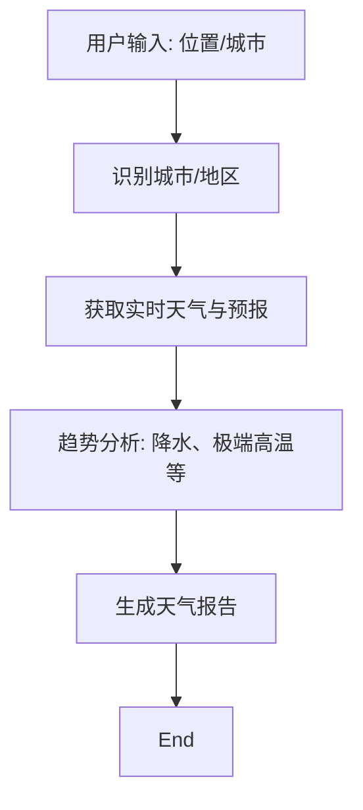

# AISOP：天气预报引擎

此 AISOP 定义了一个详尽的天气查询与分析执行流程。

> **协议版本**: AISOP 3.1
> **ID**: `soulbot.weather`

## 1. 视觉逻辑 (Mermaid)



## 2. 实现 (JSON)

```json
[
  {
    "role": "system",
    "content": {
        "protocol": "AISOP V1.0.0",
        "id": "soulbot.weather",
        "verified_on": ["Cursor", "Gemini CLI"],
        "tools": ["google_search", "web_browser"]
    }
  },
  {
    "role": "user",
    "content": {
        "instruction": "执行 aisop.weather。为指定位置提供详细的天气信息。",
        "aisop": {
            "main": "graph TD\n    ..." 
        },
        "functions": {
            "Geocode": { "step1": "使用搜索工具验证城市名或获取坐标。" },
            "Fetch": { "step1": "访问天气服务获取实时数据与预报。" },
            "Analyze": { "step1": "检查是否存在预警或显著气温变化。" },
            "Report": { "step1": "将结果格式化为带有表情符号的友好报告。" }
        }
    }
  }
]
```

## 3. 使用方法

此 AISOP 由 `main.aisop.json` 自动路由激活，也可手动指向使用。

---
*生成自 `weather.aisop.json`*
